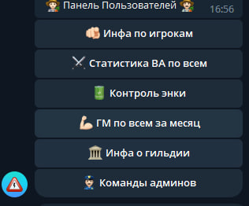
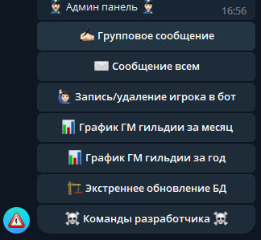

# SWGOH-COMLINK-GUILD-CONTROL-BOT-SYSTEM ru

# Описание
`Телеграм-бот` разработан как полноценная система управления и контроля гильдией по мотивам игры SWGOH.  

Выполнено по заказу [SashaBeckmann &#8599;](https://t.me/SashaBeckmann)  

Система одновременно парист 2 API по игре [comlink](https://github.com/swgoh-utils/swgoh-comlink) и [swgoh.gg](http://api.swgoh.gg/),
сохраняет данные в базу данных и предоставляет удобный интерфейс управления.
## Ключевые технологии
`python`, `aiogram`. `posgreSQL`, `alembic`, `asyncpg`, `SqlAlchemy AsyncSession`, `aiohttp`, `plotly`, `APScheduler`

### Внимание!
Бот использует только открытые данные об игре и не имеет ничего общего со взломом или реверсивной инженерией с перехватами пакетов!

## Возможности бота:
 

Детально с инструкцией по эксплуатации можно ознакомиться [тут...](readme_docs/expluatation.md)

Инструкция по установке и размещению на сервере [тут.](readme_docs/installation.md)  

Использование бота открыто для скачивания, однако, установка подразумевает наличие .env файла и специфических настроек,
которые вы можете получить от меня [тут](readme_docs/env.md) вместе с дальнейшим сопровождением и обновлениями подписавшись на мой [patreon &#8599;](https://patreon.com/Shtierlitz) за скромный донат. 

