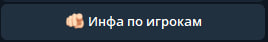
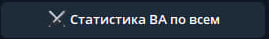
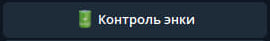
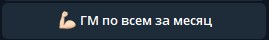

# Руководство по командам бота

В данном руководстве я опишу лишь те команды которые действительно нуждаются в пояснении 
дабы не произошли непредвиденные ошибки.

## Команды пользователей:

Запускает "состояние" для просмотра информации об игроках. 

Показывает полную статистику по всем игрокам из swgoh.gg о регистрации на текущий сезон Великой Арены, 
а так же дает ссылки на каждого противника в сезоне. Команда выполняет сложную процедуру, потому нужно подождать выполнения.

Открывает меню с возможными вариантами отчетов по рейд-купонам за день, неделю, месяц.

Показывает список рост ГМ за месяц или от ближайшей доступной даты от начала месяца по всем игрокам.

Возвращает информацию о гильдии.

Очевидно открывает список команд администраторов.

## Команды администраторов групп:

Создает "состояние" отправки сообщений выбранным членам гильдии. Команда реагирует либо на телеграм ники
игроков занесенных в бот или же на названия игровых аккаунтов, но только в том случае если в них нет смайликов.

Создает "состояние" отправки сообщения всем членам гильдии зарегистрированным в боте.

Открывает меню записи/удаления и полного списка игроков зарегестрированных в боте.  
Подробнее ниже.

Соответственно. Имеется ввиду последних 30 дней и 12 месяцев.

Команда фоновая. Так как база данных автоматически обновляется каждые 5 минут, то иногда нужно сделать это побыстрее
чтобы новейшие обновления вступили в силу. Скорость выполнения команды примерно 2 минуты. Потому, брызгать 
спинным мозгом если не обновилось сию секунду, не стоит.

Очевидно открывает список команд разработчика.

### Запись/удаления игрока в бот:

Создает "состояние" добавления данных в отдельный json файл. Очень важно тут быть внимательным и записывать правильно данные.
После записи рекомендуется нажать "Список всех", чтобы проверить, корректно ли внеслись данные.

Возвращает список всех членов гильдии которые были занесены в json файл.

Удаляет запись об игроке из json файла. Данное действие лишь прекращает обновления и вывод информации 
об игроке. Чтобы удалить полностью все данные связанные с игроком из базы данных существует отдельная команда доступная только 
супер-администратору и/или разработчику который устанавливал бот.

## Команды разработчика:

Полностью и безвозвратно удаляет все данные связанные с игроком данные из базы данных. В том числе 
и сведения об энке, гм и прочем.

Команда фоновая. Пробегает по всем чатам отсылая тестовое сообщение мгновенно его удаляя чтобы не спамить лишний раз.
Если же отсылая сообщение команда натыкается на недоступность чата, бот отсылает в чат офицеров отчет о причине недоступности.

